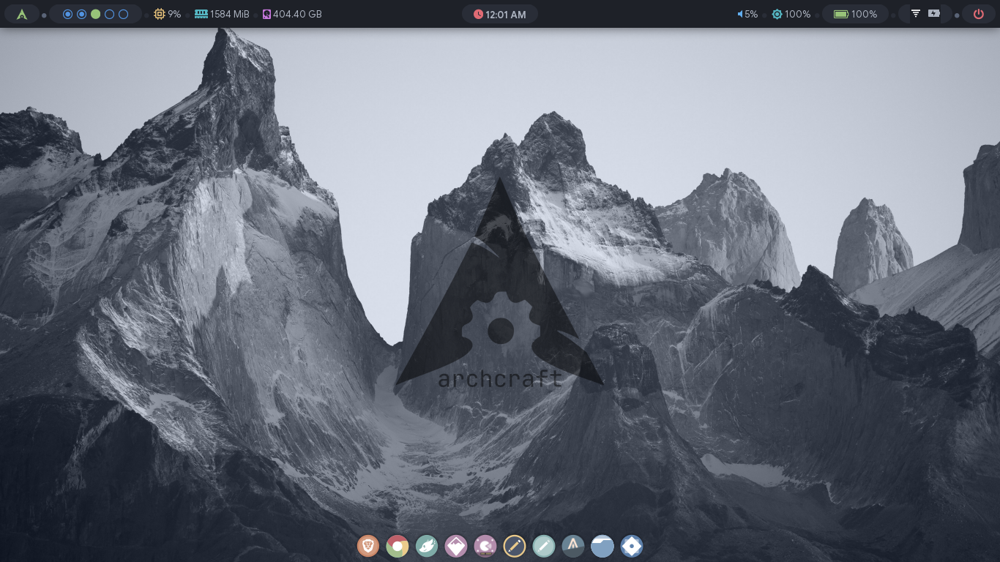
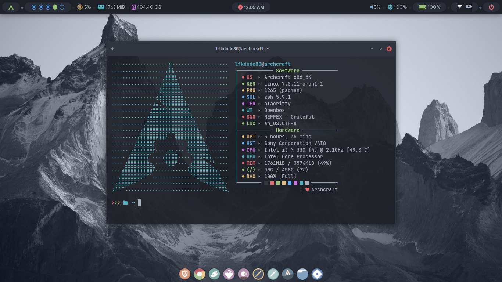

# Archcraft Dotfiles
### Sony VAIO | Openbox | Alacritty | Zsh | Polybar

My personal dotfiles for Archcraft Linux running on a Sony VAIO.
Built for a minimal, clean workflow with a dark monochrome aesthetic.

## System
- **OS:** Archcraft x86_64
- **WM:** Openbox
- **Terminal:** Alacritty
- **Shell:** Zsh 5.9.1
- **Bar:** Polybar
- **Launcher:** Rofi

## What I Actually Customized
- **Polybar** — layout, modules, fonts, and colors
- **Rofi** — launcher and powermenu themes
- **Alacritty** — font stack and color scheme
- **Wallpapers** — original backgrounds made in Inkscape
- **Zsh** — aliases and shell preferences

## Screenshots

## Notes
Base Archcraft install. Most stock files untouched.
These dotfiles only track my actual customizations.

## Theme
- **Style:** Catppuccin-Frappe
- **Icons:** Zafiro Nord Green
- **Font:** JetBrainsMono Medium
